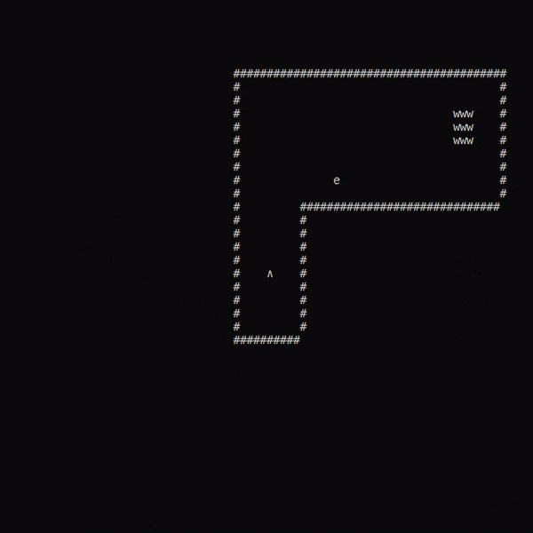

# .NET Game Engine

Elementary game engine with simple game level implementation.

Game engine supports collision and visibility detection. Graphics implemented with glorious ASCII. Primitive AI can detect and chase after player. Levels and object properties serialized in json.

